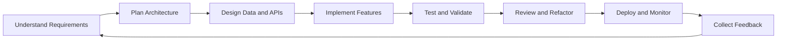

<div align="center">


# Ken Grande

### Full-Stack & Backend Software Developer

**C#/.NET · ASP.NET Core · React · Node.js · SQL · REST APIs**

Building production systems at **QuickMSP** 🇵🇭

[](https://git.io/typing-svg)

[](https://itsme-ken.vercel.app)
[](https://linkedin.com/in/kenjim-grande-87575435b)
[](mailto:kenjimgrande.dev@gmail.com)

[](https://instagram.com/kennnennnn)


</div>

---

## 👨‍💻 About Me

```csharp
public class KenGrande
{
    public string Role => "Full-Stack & Backend Software Developer";
    public string Location => "Philippines 🇵🇭";
    public string CurrentCompany => "QuickMSP";

    public string[] FocusAreas =>
    [
        "Backend Engineering",
        "Distributed Systems",
        "Clean Architecture",
        "API Design"
    ];

    public string CurrentMission =>
        "Build reliable systems that solve real operational problems.";
}
```

I am a software developer specializing in **C# and .NET backend development**, with experience building desktop, web, and mobile applications.

At QuickMSP, I contribute to trading platform systems involving market data, financial instruments, transaction workflows, portfolio information, price feeds, and data validation.

I have also designed and deployed a government information system that is actively used by a barangay office.

---

## ⚡ Developer Snapshot

<table>
<tr>
<td width="25%" align="center">

### Backend

C#
.NET
ASP.NET Core

</td>
<td width="25%" align="center">

### Frontend

React
JavaScript
Material UI

</td>
<td width="25%" align="center">

### Data

SQL Server
MySQL
Data Validation

</td>
<td width="25%" align="center">

### Platforms

Web
Desktop
Mobile

</td>
</tr>
</table>

---

## 💼 Professional Experience

<table>
<tr>
<td width="24%" valign="top">

### QuickMSP

`Feb 2026 – Present`

</td>
<td width="76%" valign="top">

### Software Developer

Developing components for trading platform systems, including:

* Market data and price-feed processing
* Ticker and financial instrument information
* Buy-and-sell transaction workflows
* Portfolio and position views
* Data validation and internal tooling
* REST API and SQL-backed application features

**Technologies**

`C#` `ASP.NET Core` `.NET` `SQL Server` `REST APIs`

</td>
</tr>

<tr>
<td width="24%" valign="top">

### Radztech Business Solutions

`Jan 2025 – May 2025`

</td>
<td width="76%" valign="top">

### Intern Software Developer

* Built responsive frontend components using React and Material UI
* Integrated frontend features with REST APIs
* Supported Node.js backend development
* Collaborated on testing, debugging, and feature implementation

**Technologies**

`React` `Material UI` `Node.js` `REST APIs`

</td>
</tr>

<tr>
<td width="24%" valign="top">

### Barangay District 1

`Aug 2024 – Jan 2025`

</td>
<td width="76%" valign="top">

### Volunteer Software Developer

Designed, built, and deployed an Integrated Barangay Information System for San Manuel, Isabela.

The platform supports:

* Resident information management
* Document and reporting workflows
* GIS-based resident mapping
* Zone-level operational monitoring
* Desktop and web-based access

**Technologies**

`C#` `.NET` `PHP` `JavaScript` `GIS`

</td>
</tr>

<tr>
<td width="24%" valign="top">

### Our Lady of Pillar College

`Aug 2023 – Dec 2023`

</td>
<td width="76%" valign="top">

### IT Assistant

* Provided technical support to staff and students
* Maintained institutional computers and IT resources
* Assisted with troubleshooting and system administration
* Supported day-to-day campus technology operations

</td>
</tr>
</table>

---

## 🚀 Featured Projects

<table>
<tr>
<td width="50%" valign="top">

### 🏛️ Integrated Barangay Information System

**Desktop and web-based government platform**

A production system for managing resident records, reports, operational workflows, and GIS-based zone mapping.

#### Key Features

* Resident information management
* GIS-based household mapping
* Document and report generation
* Administrative dashboards
* Desktop and web interfaces
* Real-world barangay deployment

#### Technology Stack


<br/>

[](https://itsme-ken.vercel.app/project1-demo.html)

</td>
<td width="50%" valign="top">

### 🌐 Personal Developer Portfolio

**Responsive personal portfolio website**

A modern portfolio showcasing my professional background, technical skills, selected projects, and contact information.

#### Key Features

* Responsive page layouts
* Interactive project previews
* Skills and experience sections
* Direct contact flow
* Mobile-friendly navigation
* Production deployment through Vercel

#### Technology Stack


<br/>

[](https://itsme-ken.vercel.app)

</td>
</tr>
</table>

---

## 🛠️ Technology Stack

### Primary Technologies

<div align="center">


</div>

<br/>

<div align="center">


</div>

### Additional Technologies

<div align="center">


</div>

---

## 🌱 Current Engineering Focus

<table>
<tr>
<td width="50%" valign="top">

### 🏗️ Architecture

* Clean Architecture
* Domain-Driven Design
* Modular monoliths
* Microservice patterns
* SOLID principles
* Separation of concerns

</td>
<td width="50%" valign="top">

### ☁️ Infrastructure

* Docker-based deployments
* RabbitMQ and Kafka
* Terraform and Bicep
* Prometheus and Grafana
* Cloud-native application design
* Environment-based configuration

</td>
</tr>

<tr>
<td width="50%" valign="top">

### 🔐 Security

* JWT authentication
* OAuth 2.0
* OpenID Connect
* ASP.NET Core Identity
* IdentityServer
* Role-based authorization

</td>
<td width="50%" valign="top">

### 📈 Reliability

* Structured logging
* Distributed tracing
* Metrics and alerting
* Resilient API design
* Automated testing
* Production monitoring

</td>
</tr>
</table>

---

## 🔧 Developer Workflow & Tools

<div align="center">


</div>

### How I Build Software



<table>
<tr>
<td width="50%" valign="top">

### 💻 Development

* Visual Studio for .NET development
* Visual Studio Code for frontend and scripting
* ASP.NET Core Web API development
* React component-based frontend development
* SQL Server database design and querying
* Reusable and maintainable application components

</td>
<td width="50%" valign="top">

### 🔌 API & Integration

* RESTful API design
* Swagger and OpenAPI documentation
* Postman request testing
* JSON data validation
* Third-party API integration
* Authentication and authorization workflows

</td>
</tr>

<tr>
<td width="50%" valign="top">

### 🌿 Version Control

* Git-based development workflow
* Feature branches
* Focused and descriptive commits
* Pull-request-based code review
* Merge conflict resolution
* Repository documentation

</td>
<td width="50%" valign="top">

### 🧪 Quality Assurance

* Input and business-rule validation
* API endpoint testing
* Debugging and error tracing
* Defensive programming
* Code refactoring
* Regression testing before deployment

</td>
</tr>

<tr>
<td width="50%" valign="top">

### 📦 Deployment

* Environment-based configuration
* Docker containerization
* Database migration management
* Application publishing
* Cloud deployment fundamentals
* Production issue investigation

</td>
<td width="50%" valign="top">

### 📋 Collaboration

* Requirement analysis
* Technical documentation
* Task breakdown and estimation
* Progress reporting
* Peer feedback
* Iterative feature delivery

</td>
</tr>
</table>

### Typical Feature Workflow

```text
01. Review requirements and expected behavior
02. Break the feature into smaller technical tasks
03. Design the data model, API contract, and UI flow
04. Implement the backend and validation rules
05. Integrate the frontend or consuming application
06. Test normal, edge, and failure scenarios
07. Refactor and document important decisions
08. Deploy, monitor, and improve from feedback
```

### Engineering Principles

<div align="center">


</div>

> I prioritize clear requirements, maintainable architecture, reliable validation, and software that remains understandable after deployment.

---

## 🧠 What I Bring to a Team

<table>
<tr>
<td width="33%" align="center" valign="top">

### Problem Solving

I break complex requirements into manageable technical tasks and investigate issues systematically.

</td>
<td width="33%" align="center" valign="top">

### System Thinking

I consider data flow, validation, maintainability, integrations, and user impact when building features.

</td>
<td width="33%" align="center" valign="top">

### Delivery Mindset

I focus on producing usable features, testing edge cases, and continuously improving deployed systems.

</td>
</tr>
</table>

---

## 📌 Selected Repositories

<!--
Replace REPO_NAME_1 and REPO_NAME_2 with your actual public repository names.

Example:
repo=barangay-information-system
-->

<div align="center">

[](https://github.com/kenneennn/REPO_NAME_1)
[](https://github.com/kenneennn/REPO_NAME_2)

</div>

---

## 📊 GitHub Analytics

<div align="center">


<br/>


<br/>


</div>

---

## 🎯 Current Goals

* Strengthen my understanding of distributed system patterns
* Build production-ready applications using Clean Architecture
* Improve observability through structured logging, tracing, and metrics
* Expand cloud infrastructure and deployment knowledge
* Develop scalable backend systems for real-world operations
* Contribute to open-source .NET and developer tooling projects

---

## 🤝 Let’s Connect

I am open to opportunities involving:

* Backend engineering
* Full-stack application development
* Financial technology
* Government technology
* Internal business systems
* REST API development
* Desktop and mobile applications
* Developer tools and automation

<div align="center">

[](mailto:kenjimgrande.dev@gmail.com)
[](https://linkedin.com/in/kenjim-grande-87575435b)
[](https://itsme-ken.vercel.app)

<br/>

### Architect solutions. Debug relentlessly. Ship with confidence.


</div>
